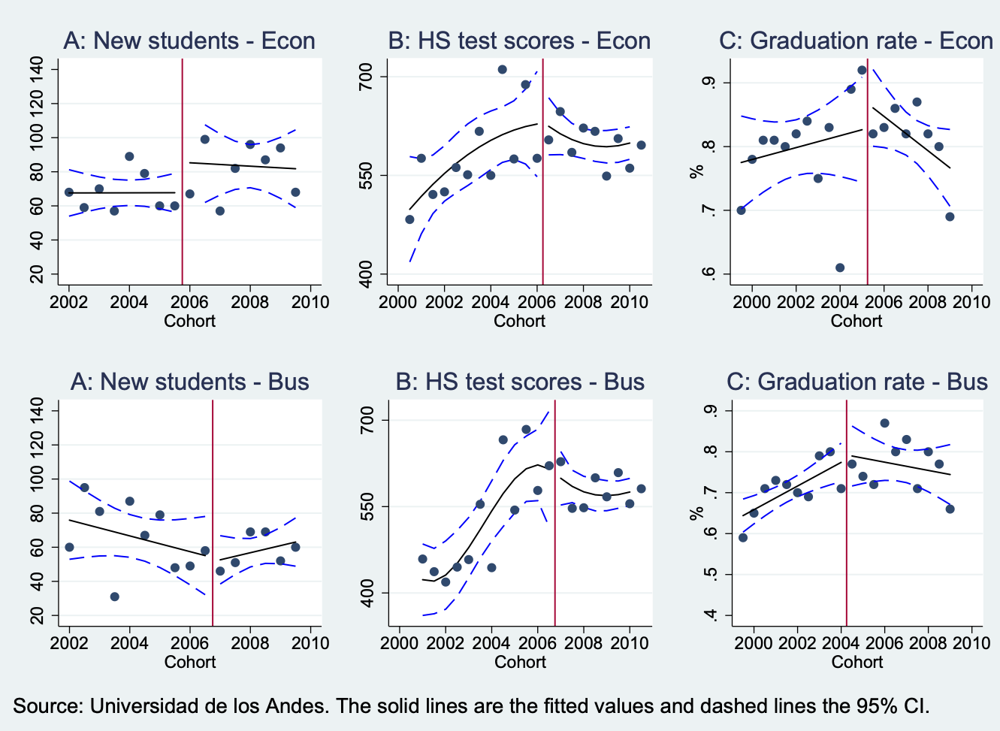
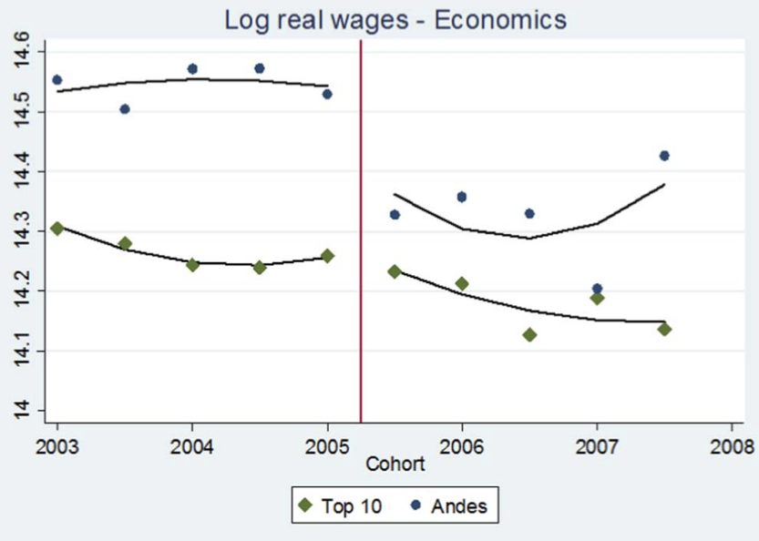

---
output:
  slidy_presentation:
    self_contained: no
    css: template.css
    includes:
      after_body: footer.html
  beamer_presentation: default
---

```{r include-logo, echo=FALSE, out.width='20%', fig.align='left'}

```

```{r include-header, echo=FALSE, out.width='70%', fig.align='center'}
knitr::include_graphics("uibk_header1.png")
```


 

<h1>404050 VU Empirical Economics: Impact Evaluation <h1>
<h3> Session 2 - Causality and Research Designs <h3>


```{r setup, include=FALSE}
knitr::opts_chunk$set(echo = FALSE, warning = FALSE, message = FALSE)
library(tidyverse)
library(purrr)
library(patchwork)
library(ggpubr)

knitr::opts_chunk$set(fig.width = 5, fig.height = 3)

theme_set(
  theme_minimal(base_size = 10) +   # Adjust base font size
  theme(
    plot.title = element_text(size = 10, face = "bold"),  # Title font size and boldness
    axis.text = element_text(size = 8),                  # Axis text size
    axis.title = element_text(size = 10),                # Axis label size
    legend.title = element_text(size = 8),               # Legend title font size
    legend.text = element_text(size = 7)                 # Legend item font size
  )
)
```

---

# Causality
- We want to know "Does X cause Y?" and "How much does X cause Y?"
- We often want to do this while only having access to observational data
- This is what the class is about

# Why Causality?

- Many of the interesting questions we might want to answer with data are causal
- Some are non-causal, too - for example, "how can we predict whether this photo is of a dog or a cat" is vital to how Google Images works, but it doesn't care what *caused* the photo to be of a dog or a cat
- Nearly every *why* question is causal
- *Because* statements are causal
- And when we're talking about people, *why* is often what we want to know!

# Also

- This is economists' comparative advantage!
- Plenty of fields do statistics. But very few make it standard training for their students to understand causality
- This understanding of causality makes economists very useful! *This* is one big reason why tech companies have whole economics departments in them

## Bringing us to...

- Part of this half of the class will be understanding what causality *is* and how we can find it
- Another big part will be understanding common *research designs* for uncovering causality in data when we can't do an experiment
- These, more than supply & demand, more than ISLM, are the tools of the modern economist!

# So what is causality?

- We say that `X` *causes* `Y` if...
- were we to intervene and *change* the value of `X` without changing anything else...
- then `Y` would also change as a result

# Some examples

Examples of causal relationships!

Some obvious:

- A light switch being set to on causes the light to be on
- Setting off fireworks raises the noise level

Some less obvious:

- Getting a college degree increases your earnings
- Tariffs reduce the amount of trade

# Some examples

Examples of non-zero *correlations* that are not *causal* (or may be causal in the wrong direction!)

Some obvious:

- More people drown on days when ice cream sales are high
- Rooster crowing sounds are followed closely by sunrise

Some less obvious:

- Colds tend to clear up a few days after you take Globuli
- The performance of the economy tends to be lower or higher depending on the political parties forming the government

# Important Note

- "X causes Y" *doesn't* mean that X is necessarily the *only* thing that causes Y
- For example, using a light switch causes the light to go on
- But not if the bulb is burned out (no Y, despite X), or if the light was already on (Y without X), and it ALSO needs electicity (something else causes Y)
- But still we'd say that using the switch causes the light! The important thing is that X *changes the distribution* of Y, not that it necessarily makes it happen for certain
- Taking an econometrics class *may* help you land a better job. But it does not necessarily.

# So How Can We Tell?

- As just shown, there are plenty of *correlations* that aren't *causal*
- So if we have a correlation, how can we tell if it *is*?
- For this we're going to have to think hard about *causal inference*. That is, inferring causality from data

# The Problem of Causal Inference

- Let's try to think about whether some `X` causes `Y`
- That is, if we manipulated `X`, then `Y` would change as a result
- For simplicity, let's assume that `X` is either 1 or 0, like "got a medical treatment" or "didn't"
  -- Think of treatment and control group

# The Problem of Causal Inference

- Now, how can we know *what would happen* if we manipulated `X`?
- Let's consider just one person - Emilia. We could just check what Emilia's `Y` is when we make `X=0`, and then check what Emilia's `Y` is again when we make `X=1`. 
- Are those two `Y`s different? If so, `X` causes `Y`!
- Do that same process for everyone in your sample and you know in general what the effect of `X` on `Y` is

# The Problem of Causal Inference

- You may have spotted the problem
- Just like you can't be in two places at once, Emilia can't exist both with `X=0` and with `X=1`. She either got that medical treatment or she didn't. 
- Let's say she did. So for Emilia, `X=1` and, let's say, `Y=10`.
- The other one, what `Y` *would have been* if we made `X=0`, is *missing*. We don't know what it is! Could also be `Y=10`. Could be `Y=9`. Could be `Y=1000`!

# The Problem of Causal Inference

- Well, why don't we just take someone who actually DOES have `X=0` and compare their `Y`?
- Because there are lots of reasons their `Y` could be different BESIDES `X`. 
- They're not Emilia! A character flaw to be sure.
- So if we find someone, Claudia, with `X=0` and they have `Y=9`, is that because `X` increases `Y`, or is that just because Emilia and Claudia would have had different `Y`s anyway?

# The Problem of Causal Inference

- The main goal we have in doing causal inference is in making *as good a guess as possible* as to what that `Y` *would have been* if `X` had been different
- That "would have been" is called a *counterfactual* - counter to the fact of what actually happened
- In doing so, we want to think about two people/firms/countries that are basically *exactly the same* except that one has `X=0` and one has `X=1`
- Alternatively, think about what would have happened to this person/firm/country in a parallel universe where `X=0` instead of `X=1`

# Potential Outcomes

- The logic we just went through is the basis of the *potential outcomes model*, which is one way of thinking about causality
- It's not the only one, or the one we'll be mainly using, but it helps!
- We can't observe the counterfactual, and must make an estimate of what the *outcome* would *potentially* have been under the counterfactual
- For making causal statements obout the world, we have to solve a *missing data problem* 
- Figuring out what makes a good counterfactual estimate is a key part of causal inference!

# Data and assumptions

- For making causal statements, we combine *data* and *assumptions*
- As we've just heard, some things cannot be learned from data alone
- We have to add assumptions about the missing parts
- The class is a lot about coming up with credible assumptions
- If we have better data, we might need fewer assumptions. But some assumptions will always remain necessary

# Experiments

- A common way to do causal inference in many fields is an *experiment*
- If you can *randomly assign* `X`, then you know that the people with `X=0` are, on average, the same as the people with `X=1`
- So that's an easy comparison!
- Statistics help us come up with credible assumptions (e.g. *Law of large numbers*)

# Experiments

- When we're working with people/firms/countries, running experiments is often infeasible, impossible, or unethical
- So we have to think hard about a *model* of what the world looks like
- So that we can use our model to figure out what the *counterfactual* would be

# Models

- In causal inference, the *model* is our idea of what we think the process is that *generated the data*
- We have to make some assumptions about what this is!
- We put together what we know about the world with assumptions and end up with our model
- The model can then tell us what kinds of things could give us wrong results so we can fix them and get the right counterfactual

# Models

- Wouldn't it be nice to not have to make assumptions?
- Yeah, but it's impossible to skip!
- We're trying to predict something that hasn't happened - a counterfactual
- This is literally impossible to do if you don't have some model of how the data is generated
- You can't even predict the sun will rise tomorrow without a model!
- If you think you can, you're just don't realize the model you're using - that's dangerous!

# An Example

- Let's cheat a bit and know how our data is generated!
- Let's say that getting `X` causes `Y` to increase by 1
- And let's run a randomized experiment of who actually gets X

```{r, echo=TRUE, eval=TRUE}
df <- data.frame(Y.without.X = rnorm(10000),X=sample(c(0,1),10000,replace=T)) %>%
mutate(Y.with.X = Y.without.X + 1) %>%
#Now assign who actually gets X
mutate(Observed.Y = ifelse(X==1,Y.with.X,Y.without.X))
#And see what effect our experiment suggests X has on Y
df %>% group_by(X) %>% summarize(Y = mean(Observed.Y))
```

# An Example

- Now this time we can't randomize X. 

```{r, echo=TRUE, eval=TRUE}
df <- data.frame(Z = runif(10000)) %>% mutate(Y.without.X = rnorm(10000) + Z, Y.with.X = Y.without.X + 1) %>%
  #Now assign who actually gets X
  mutate(X = Z > .7,Observed.Y = ifelse(X==1,Y.with.X,Y.without.X))
df %>% group_by(X) %>% summarize(Y = mean(Observed.Y))
#But if we properly model the process and compare apples to apples...
df %>% filter(abs(Z-.7)<.01) %>% group_by(X) %>% summarize(Y = mean(Observed.Y))
```

# Identification

- We have "identified" a causal effect if *the estimate that we generate gives us a causal effect*
- In other words, **when we see the estimate, we can claim that it's isolating just the causal effect**
- Simply looking at `lm(Y~X)` gives us the causal effect in the randomized-X case. `lm(Y~X)` **identifies** the effect of $X$ on $Y$
- But `lm(Y~X)` does *not* give us the causal effect in the non-randomized case we did. In that case, `lm(Y~X)` does not **identify** the causal effect, but the apples-to-apples comparison we did *does* identify the effect
- Running a regression is easy - running a *meaningful* regression and interpreting it correctly is much harder
- Causal inference is all about figuring out **what calculation we need to do to identify that effect**

# Identification

- Identifying effects requires us to understand the **data generating process** (DGP)
- And once we understand that DGP, knowing what calculations we need to do to isolate our effect
- Often these will require taking some conditional values (controls)
- Or **isolating the variation we want** in some other way

# So!

- So, as we move forward...
- We're going to be thinking about how to create models of the processes that generated the data
- And, once we have those models, we'll figure out what methods we can use to generate plausible counterfactuals
- Once we're really comparing apples to apples, we can figure out, using *only data we can actually observe*, how things would be different if we reached in and changed `X`, and how `Y` would change as a result.

# Example

-   Let's say we want to know whether going to the opera makes you live longer
-   You collect data on recently deceased people (so you know there age) and ask their relatives how often they went to the opera?
-   So we run the following regression: $Lifespan = \beta_0 + \beta_1Opera + \varepsilon$ where $Opera$ is the number of times per year you go to the opera
-   What do we want to estimate?
-   What will $\beta_1$ estimate?

# Example

-   The estimate of $\beta_1$ we get will tell us *how the conditional mean of* $Lifespan$ changes as $Opera$ changes, but what we want is *whether going to the opera more makes you live longer*
-   If we see a positive $\beta_1 > 0$, that *could* be because opera makes you live longer, but we can't rule out that it's longer-living people choosing to go to the opera
-   So, that regression does not *identify* the effect we want

# Correlation and Causation

-   In the opera example, this is clearly just a case of "correlation is not causation" but the idea of identification is a little more helpful that that
-   Because really, some correlations *are* causal. Every causation is *some* correlation (often a conditional one)
-   The task is figuring out *which correlation* identifies our effect of interest

# The Good Variation

-   Variables vary. Sort of the point.
-   Two variables can be related
-   **Why** do they vary? **Why** are they related
-   Usually you're only interested in one of the reasons
-   And that reason accounts for only *part of the variation*. Which part?

# The Good Variation

Why might opera and lifespan be related?

-   Wealthier people are more likely to go to the opera, and wealth can increase your lifespan for many reasons
-   People with certain chronic life-shortening illnesses may find it difficult to go to the opera
-   Older people are more likely to go to the opera, so you need a long lifespan in the first place to get to the opera-going part of your life
-   Maybe opera really does make you live longer

# The Good Variation

-   All those other explanations are *reasons why we might see longer-lived people going to the opera more*
-   Which is why, *when we observe longer-lived people going to the opera more*, we can't just say it's because opera makes you live longer
-   But we can get our answer! We simply have to *remove the variation that's due to those other explanations*, or *isolate just the variation we're interested in* in some way

# The Good Variation

-   One way of *removing variation due to other explanations* is controls
-   Adding a control *removes the variation that can be explained by the control variable*
-   It does this from both $X$ and $Y$, removing that part of the relationship, and *removing that reason why they're related*
-   If we can do this for *all* alternative explanations, we can isolate the variation we want and identify the effect!

# Experiments

-   Or, we can limit the data to allow only the variation we want
-   An experiment is one way of doing this.
-   If you can randomly assign people to go to the opera, then the *only variation* in opera-going in your sample is unrelated to anything like wealth, previous health, or previous age
-   So the *only part of the opera/lifespan relationship there can possibly be is if opera causes lifespan*
-   Regressing $lifespan" on $opera$ will give you the causal effect in this case

# Causal Inference

-   Identification means *isolating just the reason you want* as to why two variables are related
-   Causal inference is all about finding *which kinds of variation we need to remove* to do this, and then doing it
-   Or *isolating just the variation we need to keep*, often using experiments, or things that are experiment-like

# Example

-   Let's start with an example where we know the answer

```{r, echo = TRUE}
# Observational sample
tb_obs <- tibble(epsilon = rnorm(200), W = rnorm(200), origin = 'Observational') %>%
  mutate(X = W + rnorm(200) > 0) %>% mutate(Y = 3*X - 2*W + epsilon)

# Experimental sample
tb_exp <- tibble(epsilon = rnorm(200), W = rnorm(200), X = rnorm(200) > 0, origin = 'Experimental') %>%
  mutate(Y = 3*X - 2*W + epsilon)

# Together!
tb <- bind_rows(tb_obs, tb_exp)
```

# Example

-   How can we check whether a given method gives us the true causal effect of $X$ on $Y$ of $3$?
-   Simulate it! Create the data many times, try our method each time, and see the mean and sampling distribution of what we get

```{r, echo = TRUE}
create_data <- function() {
  tb_obs <- tibble(epsilon = rnorm(200), W = rnorm(200), origin = 'Observational') %>%
    mutate(X = W + rnorm(200) > 0) %>% mutate(Y = 3*X - 2*W + epsilon)
  tb_exp <- tibble(epsilon = rnorm(200), W = rnorm(200), X = rnorm(200) > 0, origin = 'Experimental') %>%
    mutate(Y = 3*X - 2*W + epsilon)
  tb <- bind_rows(tb_obs, tb_exp)
  return(tb)
}
```

# Example

-   Let's try regular ol' regress-$Y$-on-$X$. Shouldn't work.

```{r, echo = FALSE}
set.seed(1000)
```

```{r, echo = TRUE}
run_model <- function(x) {
  m <- lm(Y~X, data = create_data())
  return(coef(m)[2])
}

library(purrr)
1:1000 %>% map_dbl(run_model) %>% mean()
```

# Example

-   The mean of the sample distribution is off because our analysis has not eliminated the other reasons ( $W$ ) why $X$ and $Y$ might be related
-   In this case $W$ makes them *more negatively* related - still counts
-   How can we identify the effect?

# Eliminate Alternative Explanations

-   We can remove the variation in $X$ and $Y$ generated by $W$, leaving $X \rightarrow Y$ as the only possible explanation for their relationship
-   We know this identifies the effect *not because we got the right answer* (in the real world we don't know what the right answer is!) but because *based on our understanding of the data, this accounts for all alternative explanations*
-   Let's try it with a regression control

# Eliminate Alternative Explanations

```{r, echo = TRUE}
run_model_2 <- function(x) {
  m <- lm(Y~X + W, data = create_data())
  return(coef(m)[2])
}

1:1000 %>% map_dbl(run_model_2) %>% mean()
```

# Isolate Good Variation

-   Some portion of the variation identifies our effect (the portion not explained by $W$)
-   With the control we shaved away the $W$ variation to get what we want
-   But sometimes we can just locate and isolate the variation we want
-   Here, we know that the variation *among the experimental sample* identifies our effect, since among that sample there's no alternative explanation

# Isolate Good Variation

```{r, echo = TRUE}
run_model_3 <- function(x) {
  m <- lm(Y~X, data = create_data() %>% filter(origin == 'Experimental'))
  return(coef(m)[2])
}

1:1000 %>% map_dbl(run_model_3) %>% mean()
```

# Key Concepts

-   There is an *underlying true theoretical model*
-   We *want to estimate a particular part of that model* (generally, the causal effect of something on something else)
-   That model tells us *how the data is generated* ("Data Generating Process")
-   So when we *see the data*, we know all the reasons why two variables might be related
-   If we want to pick out just that causal effect, we must isolate the right variation, eliminating alternative explanations
-   Variation means *differences we can compare*, i.e. "who are we comparing for whom their differences identify the effect?"

# Arteaga 2018

-   As an example, we will look at the 2018 Carolina Arteaga study, "[The Effect of Human Capital on Earnings](https://www.sciencedirect.com/science/article/pii/S0047272717301809)"
-   We know that education increases earnings from other studies ( $Education \rightarrow Earnings$ )
-   But *why*? Two prominent explanations in economics: (1) education improves skill (human capital), which improves earnings because you become a better worker, or (2) education lets you show off your skills (signaling), which improves earnings because you can convince employers you were already a good worker
-   How can we isolate the (1) effect?

# Arteaga 2018

-   Imagine we see that people with more education earn more money. What might be the reasons for that?
-   It improves skill (human capital)
-   It lets you show off skill (signaling)
-   It gives you connections (networking)
-   It doesn't do anything, but for various reasons people who would have earned more anyway get more education (selection)
-   Other reasons!

# Arteaga 2018

-   From that, we know that simply looking at the raw earnings/schooling relationship doesn't **identify** the human capital effect
-   (and keep in mind, there are multiple effects we might *want* to identify. Identification is about the theoretical concept you *want*. Signaling would also be a way education would cause earnings, and a different study would want to identify that effect, but we don't want that here)
-   How can we isolate just the variation that represents human capital

# Arteaga 2018

-   Arteaga **thinks about the theoretical concepts at play** and says "variation related to *what you learn* is what we want, but variation related to *what the employer can see* is not, since that can be a signal"
-   So we must find cases where *some people got more school and others got less* (variation), but in a way that *changed what they learned but not what the employer sees* (identifying the human capital effect)

# Arteaga 2018

-   She found a top Colombian business school that reduced the number of classes required to graduate (changes what you learn, so variation in human capital), but not in a way that would be immediately apparent to employers (no variation in signaling)
-   Looking at students in the *same program* (no selection differences, no networking differences) before and after the change should identify **only** the human capital effect
-   What's left? We're doing a before/after comparison so there might be some wage changes over time, so we also remove any time variation in wages at *other* top business programs

# Arteaga 2018

-   What does this mean?
-   If we're right about what variation this particular setting *excludes*, then there shouldn't be any difference in the kinds of students passing through from before the change to after
-   And we can get the *effect of the reduced class material* by looking at how the wage changed before/after, compared to those same before/after changes at other institutions
-   This will be evidence of a human capital effect!

# Arteaga 2018

###### **Study Duration**

```{r, echo=FALSE, out.width="60%", out.height="60%"}
knitr::include_graphics('figures/Lecture_02_Arteaga_Duration.png')
```

# Arteaga 2018

###### **Null Before/After Selection Differences**

```{r, echo=FALSE, out.width="60%", out.height="60%"}

```

# Arteaga 2018

###### **Wage Effects in Economics**

```{r, echo=FALSE,  out.width="60%", width="60%"}

```

# Arteaga 2018

-   Notice how our approach to identification had *nothing to do with a regression*
-   The paper has a regression too, but we did this all with graphs!
-   Regression is one way to get at these effects, but it is only a tool to help is isolate variation when we want to get certain types of conditional means
-   But it is *only* a tool. Our real goal is to figure out what variation we want and think about how we can use data and setting to isolate it. Maybe we do that with regression, maybe not

# Agan & Starr 2017

-   Let's look through the (very short) paper by Again & Starr 2017.
-   They do a "field experiment" (i.e. they've randomized something but it's not done in a fully controlled lab setting)
-   But that doesn't get them off the hook of thinking about identification!

# Agan & Starr 2017

Discussion questions:

-   How do they think about the *reasons why treatment* (criminal record) *and outcome* (job callbacks) are related?
-   What variation are they interested in?
-   How do they plan to isolate that variation? Why do they think it will work?

# Next Time

-   Next time we'll be discussing an approach to modeling out these sorts of scenarios so we can know exactly how to identify the effects we want
-   These are known as *causal diagrams*
- Read Chapters 6 and 7 in *The Effect*
