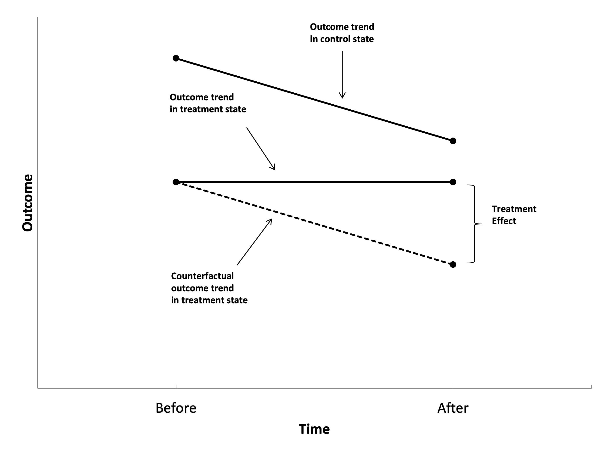

---
output:
  slidy_presentation:
    self_contained: no
    css: template.css
    includes:
      after_body: footer.html
  beamer_presentation: default
---

## 

<div class="header-container first-slide-header">
  
  
  <h1>Lecture 7: Difference-in-Differences</h1> 
</div>


```{r setup, include=FALSE}
knitr::opts_chunk$set(echo = FALSE, warning = FALSE, message = FALSE)
library(tidyverse)
library(purrr)
library(patchwork)
library(ggpubr)
library(dagitty)
library(ggdag)
library(gganimate)
library(ggthemes)
library(Cairo)
library(modelsummary)
library(wooldridge)

knitr::opts_chunk$set(fig.width = 5, fig.height = 3)

theme_set(
  theme_minimal(base_size = 10) +   # Adjust base font size
  theme(
    plot.title = element_text(size = 10, face = "bold"),  # Title font size and boldness
    axis.text = element_text(size = 8),                  # Axis text size
    axis.title = element_text(size = 10),                # Axis label size
    legend.title = element_text(size = 8),               # Legend title font size
    legend.text = element_text(size = 7)                 # Legend item font size
  )
)
```

## Today

-   Today we're going to look at one of the most commonly used methods in causal inference, called *Difference-in-Differences*.
-   Before we get there, let's look at something simpler. The *Difference Estimator*.

## Difference Estimator
- Sometimes, we observe people before and after a program.
- A possible estimator of the impact of treatment is the change in the outcome variable over time and is called the *Before-After estimator* or the *Difference estimator*.
- This is a widely popular estimator, not only among *professional program evaluators*.

{width=60%}

## The Basic Problem
-   The relationship between time and treatment is very clear: early = no treatment. Late = treatment
-   *If anything else is changing over time, we have a back door!*
  - We assume that without the treatment, the outcome would be constant.

```{r, dev='CairoPNG', echo=FALSE, fig.width=7,fig.height=3.75}
dag <- dagify(Burglaries~Police+Time,
              Police~Time,
              coords=list(
                x=c(Police=1,Burglaries=3,Time=2),
                y=c(Police=1,Burglaries=1,Time=2)
              )) %>% tidy_dagitty()
ggdag_classic(dag,node_size=20) + 
  theme_dag_blank()
```


## The Basic Problem
-   Ok, time is a back door, no problem. We can observe and measure time. So we'll just control for it and close the back door!
    -   But we can't!
-   Why not?
    -   Because in this group, you're either before treatment and `T = 0`, or after treatment and `T = 1`. If we control for time, we're effectively controlling for treatment
  -   "What's the effect of treatment, controlling for treatment" doesn't make any sense


## A solution to this problem has been developed by...

{width=68%}

Snow, John (1855), _On the Mode of Communication of Cholera_, 2nd ed., London: John Churchill.

---

## John Snow and the causes of Cholera

- Early 19th century: widely believed cause was miasma
- John Snow believed that transmission was waterborne
- Studied outbreak in a neighborhood of London
- Water supplied to households by two competing private companies:
  - Lambeth
  - Southwark & Vauxhall
- Until 1852, both companies drew their water from the Thames river downstream, which was contaminated with sewage flow from London.
- Since 1852, Lambeth moved its water source to an area relatively free from sewage.

---

## John Snow and the causes of Cholera

Death rates per 10,000 people by water company:

| Company              | 1849 | 1853/54 | Difference |
|----------------------|------|---------|------------|
| Lambeth              | 150  | 10      | -140       |
| Southwark & Vauxhall | 125  | 150     | 25         |
| *Difference*.        | 25   | -140    | *-165*     |

**Simplest case of a DiD estimator:**

- Binary treatment
- Two time periods:
  - Treatment only occurs in the second period.
- Two groups:
  - Only individuals from one group are treated.

---

## Idea of DiD

- Obtain an estimate of how the outcome would have changed for treated units in the absence of the treatment. This is a missing counterfactual trend.
- An estimate of this missing counterfactual trend could be the actual trend for some untreated group over this same time period.
- The differences-in-differences (DiD) estimator is:

\[
\tau_{DiD} = [E(Y | Group=1, Time=1) - E(Y | Group=1, Time=0)] 
\]
\[
- [E(Y | Group=0, Time=1) - E(Y | Group=0, Time=0)]
\]


---

## Idea of DiD

-   The basic idea is to *compare the changes over time across groups*
-   We have a treated group that we observe *both before and after they're treated*
-   And we have an untreated group
-   The treated and control groups probably aren't identical - there are back doors! So... we *control for group* like with group fixed effects or taking differences

## Idea of DiD

-   What kind of setup lends itself to being studied with difference-in-differences?
-   Crucially, we need to have a group (or groups) that receives a treatment and a control group that does not
    - Age ≤ 50
    - Residence in a certain state
    - All products containing meat
-   And, we need to observe them both *before* and *after* they get their treatment
-   Observing each individual (or group) multiple times


## Parametric estimation

\[
Y_i = \alpha_0 + \alpha_1 G_i + \alpha_2 T_i + \theta G_iT_i + \left(\sum_{j=1}^k \beta_j X_{jt}\right) + U_i
\]

- We control for group _G_ and and time _T_.
- The coefficient on the interaction between _G_ and _T_ gives us the differential trend between treatment and control group.

Thus, \( \theta \) identifies the effect of interest.


## Causal graph for DiD

```{r, dev='CairoPNG', echo=FALSE, fig.width=6,fig.height=4}
dag <- dagify(Y~D+Time+Group,
              D~Time+Group,
              coords=list(
                x=c(D=1,Y=3,Time=3,Group=1),
                y=c(D=2,Y=1,Time=2,Group=1)
              )) %>% tidy_dagitty()
ggdag_classic(dag,node_size=20) + 
  theme_dag_blank()
```

## Identification with DiD

{width=80%}

## Excercise

Mark the following points in the previous figure

\[
\begin{aligned}
A &= \alpha_0 + \alpha_1 + \alpha_2 + \theta \\
B &= \alpha_0 + \alpha_1 + \alpha_2 \\
C &= \alpha_0 + \alpha_2 \\
D &= \alpha_0 + \alpha_1 \\
E &= \alpha_0
\end{aligned}
\]

- *Hint:* Start with point *E*.
- Also consider how these points relate to the conditional expectations on slide 9.


## Another graphical representation

```{r, echo=FALSE, fig.width=4, fig.height=3, out.width="70%", fig.align="center"}
df <- data.frame(Control = c(rep("Control",150),rep("Treatment",150)),
                 Time=rep(c(rep("Before",75),rep("After",75)),2)) %>%
  mutate(Y = 2+2*(Control=="Treatment")+1*(Time=="After") + 1.5*(Control=="Treatment")*(Time=="After")+rnorm(300),state="1",
         xaxisTime = (Time == "Before") + 2*(Time == "After") + (runif(300)-.5)*.95) %>%
  group_by(Control,Time) %>%
  mutate(mean_Y=mean(Y)) %>%
  ungroup()

df$Time <- factor(df$Time,levels=c("Before","After"))

#Create segments
dfseg <- df %>%
  group_by(Control,Time) %>%
  summarize(mean_Y = mean(mean_Y)) %>%
  ungroup()

diff <- filter(dfseg,Time=='After',Control=='Control')$mean_Y[1] - filter(dfseg,Time=='Before',Control=='Control')$mean_Y[1]

dffull <- rbind(
  #Step 1: Raw data only
  df %>% mutate(state='1. Start with raw data.'),
  #Step 2: Add Y-lines
  df %>% mutate(state='2. Explain Y using Treatment and After.'),
  #Step 3: Collapse to means
  df %>% mutate(Y = mean_Y,state="3. Keep only what's explained by Treatment and After."),
  #Step 4: Display time effect
  df %>% mutate(Y = mean_Y,state="4. See how Control changed Before to After."),
  #Step 5: Shift to remove time effect
  df %>% mutate(Y = mean_Y 
                - (Time=='After')*diff,
                state="5. Remove the Before/After Control difference for both groups."),
  #Step 6: Raw demeaned data only
  df %>% mutate(Y = mean_Y 
                - (Time=='After')*diff,
                state='6. The remaining Before/After Treatment difference is the effect.'))

p <- ggplot(dffull,aes(y=Y,x=xaxisTime,color=as.factor(Control))) +
  geom_point() +
  guides(color=guide_legend(title="Group")) +
  geom_vline(aes(xintercept=1.5), linetype='dashed') +
  scale_color_colorblind() +
  scale_x_continuous(
    breaks = c(1, 2),
    label = c("Before Treatment", "After Treatment")
  ) +
  xlab("Time") +
  #The four lines for the four means
  geom_segment(aes(x=ifelse(state %in% c('2. Explain Y using Treatment and After.',"3. Keep only what's explained by Treatment and After."),
                            .5, NA),
                   xend=1.5,y=filter(dfseg,Time=='Before',Control=='Control')$mean_Y[1],
                   yend=filter(dfseg,Time=='Before',Control=='Control')$mean_Y[1]), size=1, color='black') +
  geom_segment(aes(x=ifelse(state %in% c('2. Explain Y using Treatment and After.',"3. Keep only what's explained by Treatment and After."),
                            .5, NA),
                   xend=1.5, y=filter(dfseg,Time=='Before',Control=='Treatment')$mean_Y[1],
                   yend=filter(dfseg,Time=='Before',Control=='Treatment')$mean_Y[1]), size=1, color="#E69F00") +
  geom_segment(aes(x=ifelse(state %in% c('2. Explain Y using Treatment and After.',"3. Keep only what's explained by Treatment and After."),
                            1.5, NA),
                   xend=2.5, y=filter(dfseg,Time=='After',Control=='Control')$mean_Y[1],
                   yend=filter(dfseg,Time=='After',Control=='Control')$mean_Y[1]), size=1, color='black') +
  geom_segment(aes(x=ifelse(state %in% c('2. Explain Y using Treatment and After.',"3. Keep only what's explained by Treatment and After."),
                            1.5, NA),
                   xend=2.5, y=filter(dfseg,Time=='After',Control=='Treatment')$mean_Y[1],
                   yend=filter(dfseg,Time=='After',Control=='Treatment')$mean_Y[1]), size=1, color="#E69F00") +
  #Line indicating treatment effect
  geom_segment(aes(x=1.5, xend=1.5,
                   y=ifelse(state=='6. The remaining Before/After Treatment difference is the effect.',
                            filter(dfseg,Time=='After',Control=='Treatment')$mean_Y[1]-diff, NA),
                   yend=filter(dfseg,Time=='Before',Control=='Treatment')$mean_Y[1]), size=1.5, color='blue') +
  #Line indicating pre/post control difference
  geom_segment(aes(x=1.5, xend=1.5,
                   y=ifelse(state=="4. See how Control changed Before to After.",
                            filter(dfseg,Time=='After',Control=='Control')$mean_Y[1],
                            ifelse(state=="5. Remove the Before/After Control difference for both groups.",
                                   filter(dfseg,Time=='Before',Control=='Control')$mean_Y[1], NA)),
                   yend=filter(dfseg,Time=='Before',Control=='Control')$mean_Y[1]), size=1.5, color='blue') +
  labs(title = 'The Difference-in-Difference Effect of Treatment \n{next_state}') +
  theme_minimal(base_size = 8) +  # Reduced the base font size
  theme(
    plot.title = element_text(size = 7),  # Title size
    axis.title = element_text(size = 5),   # Axis title size
    axis.text = element_text(size = 4),    # Axis text size
    legend.title = element_text(size = 5), # Legend title size
    legend.text = element_text(size = 4),
    plot.margin = margin(t = 30, r = 10, b = 10, l = 10)  # Legend text size
  ) +
  transition_states(state, transition_length=c(6,16,6,16,6,6), state_length=c(50,22,12,22,12,50), wrap=FALSE) +
  ease_aes('sine-in-out') +
  exit_fade() + enter_fade()

animate(p, nframes=150)
```

## Difference-in-Differences

-   It's important in cases like this (and in all cases!) to think hard about whether we believe our causal diagram, and what that entails
-   Which, remember, is this:

```{r, dev='CairoPNG', echo=FALSE, fig.width=6,fig.height=4}
dag <- dagify(Y~D+Time+Group,
              D~Time+Group,
              coords=list(
                x=c(D=1,Y=3,Time=3,Group=1),
                y=c(D=2,Y=1,Time=2,Group=1)
              )) %>% tidy_dagitty()
ggdag_classic(dag,node_size=20) + 
  theme_dag_blank()
```

## Identification with DiD: Common Trend Assumption

- The key identifying assumption of the DiD estimator is that the observed trend of the comparison group is the same as the counterfactual trend of the treated group.   
    -   i.e. if the treatment had not occurred, the gap between treatment and control would have stayed the same after treatment as it was before treatment
    
- How do we know this is true?
    - We don't! It's one of these untestable assumptions. We have to select a control group where we can plausibly *assume* that the trends are identical.
    - An indirect test is to look whether treatment and control group followed parallel trends in the periods before the treatment.

## Identification with DiD: No Anticipation Effects

- This assumption is specific to DiD and a bit hard to see.

- Assume we are interested in evaluating the effect of a VAT raise for certain goods on the demand for these goods.

- Demand for these goods might increase in the pre-treatment period if people buy ahead.

- For DiD studies, it is important to consider whether the *announcement* of a policy could have had an effect.


## Some practical considerations for DiD I

- **Institutional setting**: Be clear about the policy change (policy changes often come in bundles).
- **Endogenous policy**: Maybe groups have lobbied for a policy in expectation of certain trends in outcomes.
- **Spillovers**: Choose a control group that reasonably follows parallel trends but that is not affected by the treatment in any way.
- **Timing**: Announcement might have an effect even before the policy is officially in place (anticipation effect).

---

## Some practical considerations for DiD II

- Discuss parallel trend assumptions: Show pre-treatment trends.
- Compositional effects: Can the treatment change the composition of the treated group, i.e., by encouraging people to move in or out of a treated area?
- Try a flexible DiD specification that allows you to trace out the full adjustment path.
- Estimating standard errors in DiD settings is often difficult. Most common strategy is to cluster standard errors at the group level. See also Section 8.2.2 in *Angrist and Pischke (2009)*.

---

## Application: Extending unemployment benefits and early retirement

- *Inderbitzin, Staubli, and Zweimueller (2016)* study the causal impact of extended UI benefits on:
  - The incidence of early retirement.
  - The particular pathways through which workers exit the labor market.
- In Austria, in the late 1980s and early 1990s, workers aged 50+ were eligible for one year of regular UI benefits. Workers aged 55+ had relaxed access to DI benefits.
- For empirical identification, they exploit the regional extended benefits program (REBP) that changed early retirement incentives dramatically.
- The program was in place between June 1988 and July 1993 and granted UI benefits for up to 4 years to workers aged 50+ living in certain regions of the country.

---

## Regional distribution of program eligibility

{width=90%}

---

## Early Retirement pathways for unem- ployed men with/without REBP eligibility

{width=90%}

 <font size="3">**Notes:**
Gray arrows denote maximum duration of regular UI benefits without REBP (1 year), and black arrows denote maximum duration of regular UI benefits with REBP (4 years). Unemployed men can retire early with DI at age 54 without the REBP and age 51 with the REBP by claiming regular UI benefits followed by a DI pension at age 55 (early retirement with DI). Unemployed men can retire early without DI at age 58 without the REBP and age 55 with the REBP by claiming regular UI benefits followed by special income support at age 59 and an old-age pension at age 60 (early retirement without DI). </font>

---

## Transitions into early retirement

{width=90%}

---

## Trends in transitions into early retirement with and without DI

{width=66%}

{width=66%}

---

## DiD regression estimates

{width=80%}
